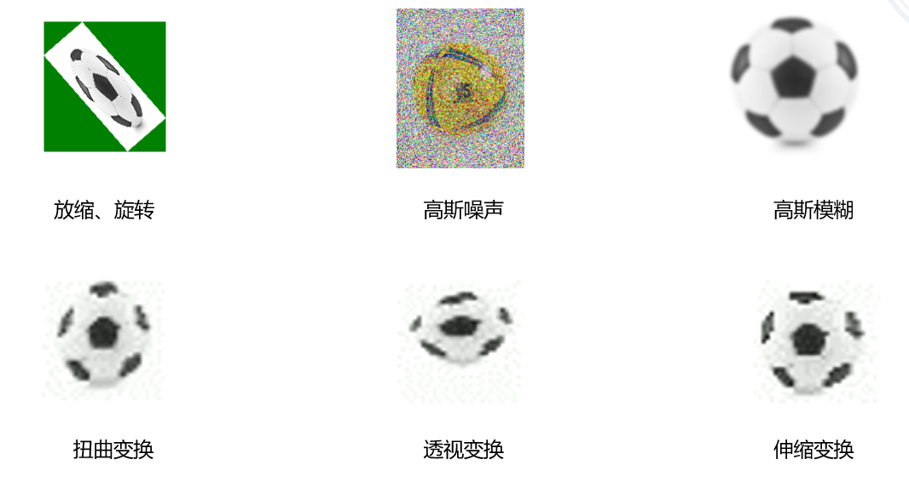
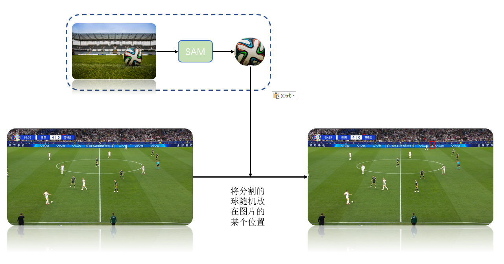

# Data augmentation method for ball tracking

# 数据增强

数据增强是一种常用的技术，旨在通过对现有训练数据进行变换和扩展，以提高机器学习模型的性能和泛化能力。该方法在计算机视觉、自然语言处理和其他领域中广泛应用，特别是在数据获取成本高或难以收集的情况下。由于足球标注数据集的构建需要大量的人力和物力，而现有的数据集往往无法涵盖复杂场景，例如球在高速运动时的形变以及足球场长镜头造成的模糊。因此，合理利用现有数据集进行数据增强是一种低成本且有效的应对方法。

## 复杂场景

在实际应用模型的过程中，我们发现模型失效主要发生在以下一些场景当中：

* 在高速运动状态下，足球常常会出现模糊和扭曲现象。这种现象不仅影响了球的清晰度，还可能导致视觉识别系统在追踪和定位球的过程中出现困难，从而降低了检测的准确性。
* 在不同的镜头距离下，足球的大小表现存在显著差异。在远镜头下，足球看起来较小，并且细节模糊，而在近距离镜头下，足球则显得更大且细节清晰。这种变化可能会对模型的训练和测试造成挑战，特别是在需要精确识别球的情况下。
* 当足球的背景为观众席或广告牌时，检测效果往往不理想。这是因为背景的复杂性和色彩的多样性会干扰模型的识别能力，导致误检测或漏检测。这种背景干扰在比赛现场尤为明显，影响了对足球的准确定位和跟踪。

## 增强方法

数据增强是通过对现有数据集进行一系列随机变换，生成新的数据样本。这些变换可以是几何、颜色、噪声等方式，目的是增加数据的多样性，从而使模型更好地学习到不同场景和条件下的特征。

### 单一增强方法

1. **放缩**：放缩是通过改变图像的尺寸来增强数据。可以通过放大来增加细节的可视化，或者通过缩小来减少计算量。放缩有助于模拟不同距离下的物体观察效果。
2. **旋转**：旋转是将图像围绕中心点进行一定角度的旋转。这种方法可以增强模型对物体方向变化的鲁棒性，特别是在物体可能以不同角度出现时。
3. **高斯噪声**：向图像中添加高斯噪声，可以帮助模型学习到在噪声环境下的特征。这种方法对于提高模型的泛化能力非常有效，尤其是在处理真实世界中的图像时。
4. **高斯模糊**：高斯模糊是通过高斯函数对图像进行模糊处理，减少图像的细节和噪声。这种方法可以帮助模型关注更大的结构和形状，而不是细节，适合在某些任务中减少过拟合。
5. **灰度化**：将彩色图像转换为灰度图像，可以减少输入数据的维度，降低计算复杂度。灰度化有助于模型关注形状和纹理特征，而不是颜色信息，适用于某些特定场景。

### 混合增强方法

1. **扭曲**：扭曲是通过对图像进行非线性变换（如波浪形变）来改变图像的形状。这种方法可以模拟现实世界中物体的变形，增加模型对物体形状变化的适应能力。
2. **伸缩**：伸缩是指在一个方向上拉伸或压缩图像。这种方法可以增强模型对不同物体比例的学习能力，尤其是在处理不同尺寸物体时。
3. **视角变换**：视角变换是通过改变观察视角来生成图像的新版本。这种方法可以创建从不同角度观察同一物体的图像，增强模型对三维结构理解的能力。

### 增强效果

​​

## 针对球在非绿地背景下检测效果不好的增强

当足球的背景为观众席或广告牌时，检测效果往往不理想。这主要是由于背景的复杂性和色彩的多样性干扰了模型的识别能力，导致误检测或漏检测的情况。在比赛现场，这种背景干扰尤为明显，严重影响了对足球的准确定位和跟踪。

为了解决这一问题，我们尝试增加球背景的多样性。具体方法是应用SAM模型，将足球从原始图片中完整分割出来，然后将其放置到不同的广告牌或观众席背景中。通过这种方式，我们可以实现针对观众席或广告牌背景的数据增强。具体流程如下图所示：

​​

# 规则方法

## **基于距离的误检目标过滤**

在球的运动过程中，保持其位置的连续性是确保准确跟踪和识别的关键因素。尽管摄像头可能会因拍摄角度或运动而发生移动，但我们可以假设当前帧中检测到的目标与上一帧检测到的目标之间的距离不会过大。基于这一假设，我们可以采用以下方法进行有效的过滤和优化。

### 1. 连续性假设

该假设基于物理运动的基本规律，即物体在短时间内的位移通常是有限的。在正常的比赛场景中，足球的运动速度虽然较快，但在相邻帧之间，球的位置变化通常不会超过一个特定的阈值。这为我们提供了一个有力的依据，用于判断检测到的目标是否合理。

### 2. 过滤策略

为了实现有效的目标过滤，我们可以采用以下步骤：

* **距离计算**：在每一帧中，计算当前检测到的足球位置与上一帧中已知足球位置之间的欧几里得距离。如果该距离超过了设定的阈值，则认为当前检测目标不可信。
* **动态阈值**：根据比赛的实际情况，可以设置一个动态的阈值。例如，在快速运动或者突然变化的场景中，阈值可以适度提高，以适应球的快速移动。
* **多帧跟踪**：除了与上一帧的比较，还可以利用多帧的信息进行综合判断。通过对连续多帧的检测结果进行分析，计算球在多个时间点的平均位置，从而更准确地判断当前帧的检测目标是否合理。

### 3. 误检测处理

通过这种基于位置连续性的过滤机制，可以有效减少误检测和漏检测的情况：

* **排除异常值**：那些与上一帧位置偏差过大的检测目标会被排除，从而降低背景干扰和噪声的影响。
* **增强稳定性**：在连续几帧中保持对同一目标的跟踪，能够增强模型对目标的稳定性，使得检测结果更加可靠。

### 4. 应用效果

通过应用这一过滤方法，我们可以显著提高足球检测的准确性和鲁棒性。尤其是在复杂的比赛场景中，这种方法能够有效降低由背景复杂性和摄像头移动引起的误差，从而实现更精确的目标跟踪。

## **基于大小的误检目标过滤**

在球的运动过程中，球的大小通常不会发生剧烈变化。基于这一特性，我们可以通过维护一个球的平均大小来有效过滤那些与当前平均值相差较大的检测目标，从而排除明显的误检。以下是对这一过滤思想的详细扩展：

### 1. 大小稳定性假设

在正常的比赛环境中，足球的尺寸在不同的拍摄角度和距离下会有一定的变化，但这种变化是相对有限的。因此，假设在相邻帧之间，足球的大小变化不会超过一个预设的范围，这为我们提供了过滤的依据。

### 2. 平均大小维护

为了实现有效的目标过滤，我们可以采取以下步骤：

* **计算平均大小**：在多帧检测中，实时计算检测到的足球的平均大小。这个平均值可以通过简单的算术平均或者加权平均的方式来获得，后者可以更好地反映球的实际大小。
* **设定阈值**：根据足球的标准尺寸，设定一个合理的大小阈值。例如，可以定义一个允许的大小变化范围，以便在实际检测中进行判断。

### 3. 过滤策略

通过维护平均大小，我们可以实施以下过滤策略：

* **大小比较**：在每一帧中，将检测到的足球大小与当前的平均大小进行比较。如果检测到的大小超出预设的范围，则认为该检测结果是误检。
* **动态调整**：根据比赛的实际情况，动态调整平均大小和阈值，以适应不同的场景和摄像头距离。这种灵活性有助于提高过滤的准确性。

### 4. 增强检测稳定性

通过实施这一基于大小的过滤机制，我们可以增强足球检测的稳定性：

* **排除异常值**：将与平均大小相差过大的检测目标排除，从而有效减少背景干扰和噪音的影响。
* **提高准确性**：通过聚焦于符合预期大小的目标，进一步提高模型的检测准确性，确保只保留真实的足球目标。

### 5. 应用效果

这种基于大小的过滤方法能够显著提升足球检测的效果，尤其是在复杂背景和动态场景中。通过减少误检，系统能够更高效地进行目标跟踪和分析。

# 安装

```python
opencv-python               4.6.0
Pillow                      9.2.0
ultralytics                 8.3.33
```

# 使用

## [单一增强](https://github.com/Xv-M-S/BallTrack/blob/main/DataAugment/AugmentMethod.py)

在`AugmentMethod.py`​文件中定义了单一增强的方法函数：

* 放缩方法：`ellipse_image()`​
* 灰度化的同时加高斯噪声：`add_gaussian_noise()`​
* 保持原本颜色同时加高斯噪声：`add_gaussian_noise_color()`​
* 模糊图片方法: `blur_image()`​
* 高斯模糊方法：`Gaussian_blur_image()`​
* 多层模糊(模糊层数越多，效果越明显)：`apply_multiple_blurs()`​

## [单一增强的批量增强方法](https://github.com/Xv-M-S/BallTrack/blob/main/DataAugment/BatchAugment.py)

方法函数：`process_dataset(data_dir, output_dir, times=1)`​

* 输入（`data_dir`​）：需要增强的YOLO格式数据集文件路径

  * ```txt
    .
    ├── images
    │   ├── train
    │   └── val
    └── labels
        ├── train
        └── val
    ```

* 输出(`output_dir`​)：增强后的数据集路径
* 增强次数（`times`​）：单张图片增强的次数

## [混合增强方法](https://github.com/Xv-M-S/BallTrack/blob/main/DataAugment/Ball-Image-Augmentation-Method/augment.py)

**扭曲**：`distort()`​

**伸缩**：`stretch()`​

**视角变换**：`perspective()`​

## [把球用SAM分割出来放在任意位置](https://github.com/Xv-M-S/BallTrack/blob/main/DataAugment/put_ball_everywhere/put_ball_everywhere.py)

1. 首先找几张比较清晰的球的图片，使用[SAM在线demo网站](https://segment-anything.com/demo)分割出球，放到``​文件夹下
2. 找需要放球的数据集作为背景图片
3. 指定增强图片和标注的输出文件夹
4. 运行`process_images()`​函数

## [把球用SAM分割出来放到广告牌处](https://github.com/Xv-M-S/BallTrack/blob/main/DataAugment/put_ball_everywhere/put_ball_on_real_ad.py)

1. 首先找几张比较清晰的球的图片，使用[SAM在线demo网站](https://segment-anything.com/demo)分割出球，放到``​文件夹下
2. 使用darklabel标注软件标注出含有广告牌的位置，标注保存为yolo格式
3. 指定增强图片和标注的输出文件夹
4. 运行`process_images()`​函数

‍
